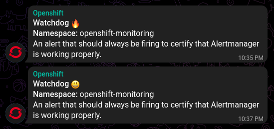

# Levar - Openshift Webhook Telegram Receiver

A very simple lua application to redirect Openshift alert webhook messages to Telegram wrapped in a tiny container with less than 18mb.

This application was build with [Lapis](https://leafo.net/lapis/) framework and runs on [OpenResty](https://openresty.org/en).

## Test

Inside the folder `manifests` there is some Openshift examples, the following one is for testing purposes only:

```bash
podman run -ti --rm -p 8080:8080 \
    -e BOT_NAME='<bot_name>' \
    -e BOT_TOKEN='<bot_token>' \
    -e API_URL="https://api.telegram.org/" \
    -e CHAT_ID='<chat_id>' \
    hectorvido/levar

curl -d @payload.json -H 'Content-Type: application/json' localhost:8080
```

The message contains only the alert name, the namespace and the alert description. A fire icon indicate a firing alert and a smile face indicate a resolved one.



## Variables

The application depends on these variables:

```bash
CHAT_ID=<chat>
API_URL=https://api.telegram.org/
BOT_TOKEN=<token>
```

The proxy is optional:

```bash
HTTP_PROXY=http://10.0.0.1:3128
HTTPS_PROXY=http://10.0.0.1:3128
NO_PROXY=localhost
```

### Payload Example

```json
{"groupLabels":{"namespace":"openshift-monitoring"},"commonLabels":{"openshift_io_alert_source":"platform","alertname":"Watchdog","managed_cluster":"1e867401-f870-4251-b463-31db706f5744","severity":"none","namespace":"openshift-monitoring","prometheus":"openshift-monitoring\/k8s"},"commonAnnotations":{"summary":"An alert that should always be firing to certify that Alertmanager is working properly.","description":"This is an alert meant to ensure that the entire alerting pipeline is functional.\nThis alert is always firing, therefore it should always be firing in Alertmanager\nand always fire against a receiver. There are integrations with various notification\nmechanisms that send a notification when this alert is not firing. For example the\n\"DeadMansSnitch\" integration in PagerDuty.\n"},"externalURL":"https:\/\/\/console-openshift-console.apps.ocp-01.tdigital-vivo.com.br\/monitoring","receiver":"Default","alerts":[{"fingerprint":"cbe3d2f66dfdb788","labels":{"openshift_io_alert_source":"platform","alertname":"Watchdog","managed_cluster":"1e867401-f870-4251-b463-31db706f5744","severity":"none","namespace":"openshift-monitoring","prometheus":"openshift-monitoring\/k8s"},"startsAt":"2023-01-03T21:53:28.39Z","endsAt":"0001-01-01T00:00:00Z","generatorURL":"https:\/\/prometheus-k8s-openshift-monitoring.apps.ocp-01.tdigital-vivo.com.br\/graph?g0.expr=vector%281%29&g0.tab=1","status":"firing","annotations":{"summary":"An alert that should always be firing to certify that Alertmanager is working properly.","description":"This is an alert meant to ensure that the entire alerting pipeline is functional.\nThis alert is always firing, therefore it should always be firing in Alertmanager\nand always fire against a receiver. There are integrations with various notification\nmechanisms that send a notification when this alert is not firing. For example the\n\"DeadMansSnitch\" integration in PagerDuty.\n"}}],"truncatedAlerts":0,"groupKey":"{}:{namespace=\"openshift-monitoring\"}","status":"firing","version":"4"}
```

## Build

```bash
cd container
podman build -t levar -f Containerfile ../
```
